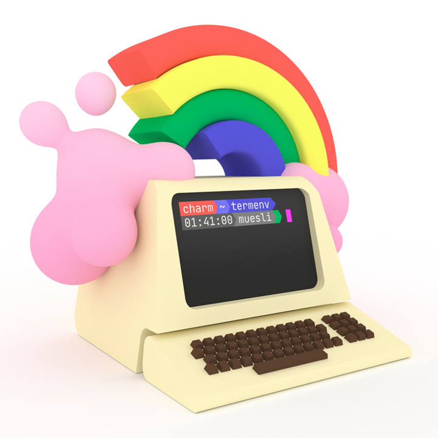

### Hi there 👋

What's this? A mysterious secret page? Shhh, don't tell anyone!

#### 🌱 Check out what I'm currently working on

- [Beehive](https://github.com/muesli/beehive), a light-weight event agent (like IFTTT)
- [Glow](https://github.com/charmbracelet/glow), a markdown viewer for the terminal
- [Knoxite](https://github.com/knoxite/knoxite), a backup & data storage tool
- [Deckmaster](https://github.com/muesli/deckmaster), which lets you control your Elgato Stream Deck on Linux

#### 💬 Feedback

If you use one of my projects, I'd love to hear from you! Don't be shy and let me know what you liked
and what needs being improved. Got an issue? Open a ticket, I don't bite and will try my best to help!

#### 📫 How to reach me

- Twitter: https://twitter.com/mueslix
- Fediverse: https://mastodon.social/@fribbledom
- Blog: https://fribbledom.com
- IRC: muesli on freenode

<!--
**muesli/muesli** is a ✨ _special_ ✨ repository because its `README.md` (this file) appears on your GitHub profile.

Here are some ideas to get you started:

- 🔭 I’m currently working on ...
- 🌱 I’m currently learning ...
- 👯 I’m looking to collaborate on ...
- 🤔 I’m looking for help with ...
- 💬 Ask me about ...
- 😄 Pronouns: ...
- ⚡ Fun fact: ...
-->
